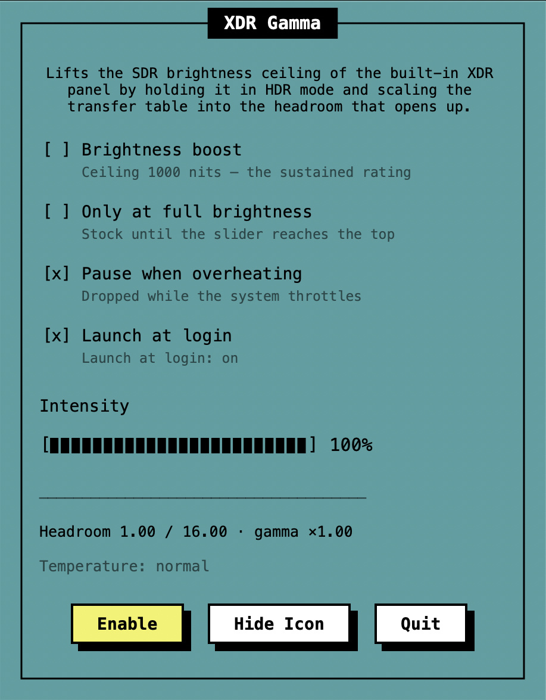

# XDRGamma

Get the extra brightness your MacBook Pro's XDR display keeps for HDR — for everything else too.

**[Download XDRGamma.zip](https://github.com/yjujq/XDRGamma/releases/latest/download/XDRGamma.zip)**

## What it does

- Push the brightness slider to the top and the screen keeps going: documents, web pages and photos get brighter than macOS normally allows.
- Below the top of the slider the display is left exactly as it was. Turn off **Only at Full Brightness** to spread the boost across the whole slider instead.
- Invisible to screenshots and screen recordings, and light on the CPU (about 0.24%).
- Pauses itself while the Mac is running hot, and comes back when it cools down.
- Steps aside while Photos, Preview or QuickTime Player is in front, where HDR photos and clips live. Turn off **Pause for HDR apps** to keep it on.
- Launch at login, and an optional hidden menu bar icon — open the app again to bring it back.

## Manual



1. **Click the sun** in the menu bar to open the panel; click it again, or anywhere else, to close it.
2. **Press Enable** and push the brightness slider to the top — the screen gets brighter than macOS allows on its own.
3. **Intensity** sets how far the boost goes. The options above it choose when it runs: only at full brightness, pausing when hot, launching at login, stepping aside for HDR apps.
4. The line at the foot shows the **headroom** the display has opened and the gamma in use — proof the boost is on.
5. **Hide Icon** removes the sun; open XDRGamma again to bring it back.

## Install

1. Download **XDRGamma.zip**, unzip it and move **XDRGamma.app** to Applications.
2. Open it. The app is not notarized, so macOS stops it the first time: open **System Settings → Privacy & Security** and click **Open Anyway**.
3. Click the sun in the menu bar and turn the boost on — it starts off.

## Requirements

An Apple Silicon MacBook Pro with a Liquid Retina XDR display, macOS 14 or later.

## Permissions

None.

## Good to know

- While the boost is on, HDR video and photos lose their brightest highlights. Turn it off before a film, or leave **Pause for HDR apps** on.
- If the screen ever stays too bright after a crash, reset it:

  ```sh
  swift -e 'import CoreGraphics; CGDisplayRestoreColorSyncSettings()'
  ```

## Build from source

```sh
./make-app.sh && open XDRGamma.app
```

Swift, public APIs only.

## Thanks

[BrightIntosh](https://github.com/niklasr22/BrightIntosh) ·
[BetterDisplay wiki](https://github.com/waydabber/BetterDisplay/wiki/XDR-and-HDR-brightness-upscaling) ·
[Explore HDR rendering with EDR, WWDC21](https://developer.apple.com/videos/play/wwdc2021/10161/)

## Privacy

XDRGamma collects nothing and makes no network connections.

## License

GPL-3.0 — see [LICENSE](LICENSE) and [NOTICE](NOTICE). Parts of it follow [BrightIntosh](https://github.com/niklasr22/BrightIntosh), which is GPL-3.0 as well.
